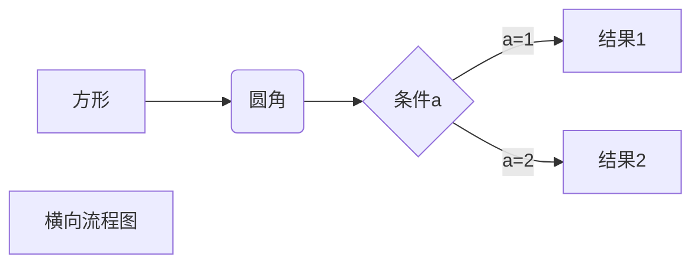

# Markdown 常用功能介绍

## 标题
Markdown 标题有两种，一种是用 = 或者 - 组成的行分割，另一种是以 #加空格开头的行，常用的是 # 方法。

第一种，使用 = 和 - 标记一级和二级标题：
```
我展示的是一级标题
=================

我展示的是二级标题
-----------------
```

第二种，使用 # 号可表示 1-6 级标题，一级标题对应一个 # 号，二级标题对应两个 # 号，以此类推。
```
# 一级标题
## 二级标题
### 三级标题
#### 四级标题
##### 五级标题
###### 六级标题
```

## 段落

段落使用两个空格或者两个换行。

## 字体

常用字体有以下几种：
```
*斜体文本*  
_斜体文本_  
**粗体文本**  
__粗体文本__  
***粗斜体文本***  
___粗斜体文本___
```
显示效果：  
*斜体文本*  
_斜体文本_  
**粗体文本**  
__粗体文本__  
***粗斜体文本***  
___粗斜体文本___

也可以用html标签来用更复杂的字体，例如变色等：
```
<font color='red'>红色</font>
```
显示效果：  
<font color='red'>红色</font>

### 行分割线
你可以在一行中用三个以上的星号、减号、底线来建立一个分隔线，行内不能有其他东西。你也可以在星号或是减号中间插入空格。下面每种写法都可以建立分隔线

```
***

* * *

*****

- - -

----------
```

## 删除线
如果段落上的文字要添加删除线，只需要在文字的两端加上两个波浪线 ~~ 即可，实例如下：
```
~~Markdown~~
```
显示效果：  
~~Markdown~~

## 下划线
下划线可以通过 HTML 的 `<u>` 标签来实现：
```
<u>Markdown</u>
```
显示效果：  
<u>Markdown</u>

## 脚注

脚注是对文本的补充说明。注意有些地方是不支持脚注的。Markdown 脚注的格式如下:
```
创建脚注格式类似这样 [^RUNOOB]。

[^RUNOOB]: Markdown 脚注示例。
```

创建脚注格式类似这样 [^RUNOOB]。

[^RUNOOB]: Markdown 脚注示例。


## 列表
Markdown 支持有序列表和无序列表。

### 无序列表
无序列表使用星号(`*`)、加号(`+`)或是减号(`-`)作为列表标记，这些标记后面要添加一个空格，然后再填写内容：
```
* 第一项
* 第二项
* 第三项

+ 第一项
+ 第二项
+ 第三项

- 第一项
- 第二项
- 第三项
```
显示效果：  
* 第一项
* 第二项
* 第三项

+ 第一项
+ 第二项
+ 第三项

- 第一项
- 第二项
- 第三项

### 有序列表
有序列表使用数字并加上 . 号来表示，如
```
1. 第一项
2. 第二项
3. 第三项
```
显示效果：  
1. 第一项
2. 第二项
3. 第三项

### 列表嵌套
列表嵌套只需在子列表中的选项前面添加四个空格即可：

```
1. 第一项：
    - 第一项嵌套的第一个元素
    - 第一项嵌套的第二个元素
2. 第二项：
    - 第二项嵌套的第一个元素
    - 第二项嵌套的第二个元素
```
显示效果：  
1. 第一项：
    - 第一项嵌套的第一个元素
    - 第一项嵌套的第二个元素
2. 第二项：
    - 第二项嵌套的第一个元素
    - 第二项嵌套的第二个元素

## 区块

### 普通区块
Markdown 区块引用是在段落开头使用 > 符号 ，然后后面紧跟一个空格符号：
```
> 区块引用
> 菜鸟教程
> 学的不仅是技术更是梦想
```
显示效果：  
> 区块引用
> 菜鸟教程
> 学的不仅是技术更是梦想

### 嵌套区块
另外区块是可以嵌套的，一个 > 符号是最外层，两个 > 符号是第一层嵌套，以此类推：
```
> 最外层
> > 第一层嵌套
> > > 第二层嵌套
```
显示效果：  
> 最外层
> > 第一层嵌套
> > > 第二层嵌套

### 区块中使用列表
区块中使用列表：
```
> 1. 第一项
> 2. 第二项
> + 第一项
> + 第二项
> + 第三项
```
显示效果：  
> 1. 第一项
> 2. 第二项
> + 第一项
> + 第二项
> + 第三项

### 列表中使用区块
```
列表中使用区块
* 第一项
    > 1. 第一项
    > 2. 第二项 
* 第二项
```
显示效果：  
* 第一项
    > 1. 第一项
    > 2. 第二项 
* 第二项

## 代码
### 行内代码
如果是段落上的一个函数或片段的代码可以用反引号把它包起来（`），例如：

```
`printf()` 函数
```
显示效果：  
`printf()` 函数

### 代码区块
使用 ``` 包裹一段代码，并指定一种语言（也可以不指定）：

```Python
print('Markdown')
```

```Python
print('Markdown')
```

## 链接
链接使用方法如下：
```
[链接名称](链接地址)
<链接地址>
```
[BitLines](https://bitlines.github.io/)  
<https://bitlines.github.io/>

## 图片
Markdown 图片语法格式如下：
```


```
语法说明：
1. 开头一个感叹号 !
2. 接着一个方括号，里面放上图片的替代文字
3. 接着一个普通括号，里面放上图片的网址，最后还可以用引号包住并加上选择性的 'title' 属性的文字。

也可以硬核使用 html 标签，对图片指定一些位置、大小等信息。
```

```

## 表格
Markdown 制作表格使用 | 来分隔不同的单元格，使用 - 来分隔表头和其他行。

语法格式如下：
```
|  表头   | 表头  |
|  ----  | ----  |
| 单元格  | 单元格 |
| 单元格  | 单元格 |
```

显示效果：  
|  表头   | 表头  |
|  ----  | ----  |
| 单元格  | 单元格 |
| 单元格  | 单元格 |

我们可以设置表格的对齐方式：

1. -: 设置内容和标题栏居右对齐。
2. :- 设置内容和标题栏居左对齐。
3. :-: 设置内容和标题栏居中对齐。

```
| 左对齐 | 右对齐 | 居中对齐 |
| :-----| ----: | :----: |
| 单元格 | 单元格 | 单元格 |
| 单元格 | 单元格 | 单元格 |
```
显示效果：  
| 左对齐 | 右对齐 | 居中对齐 |
| :-----| ----: | :----: |
| 单元格 | 单元格 | 单元格 |
| 单元格 | 单元格 | 单元格 |

## HTML标签
Markdown 中可以写html控制字体，位置等信息。不在 Markdown 涵盖范围之内的标签，都可以直接在文档里面用 HTML 撰写。
支持的 HTML 元素有：`<kbd> <b> <i> <em> <sup> <sub> <br>`等 ，如：
```
使用 <kbd>Ctrl</kbd>+<kbd>Alt</kbd>+<kbd>Del</kbd> 重启电脑
```
显示效果：  
使用 <kbd>Ctrl</kbd>+<kbd>Alt</kbd>+<kbd>Del</kbd> 重启电脑

## 公式
当你需要在编辑器中插入数学公式时，可以使用两个美元符 $$ 包裹 TeX 或 LaTeX 格式的数学公式来实现。提交后，问答和文章页会根据需要加载 Mathjax 对数学公式进行渲染。如：

```
$$f(x)=w\cdot x+b$$
```
显示效果：  
$$f(x)=w\cdot x+b$$


## 其他高级用法
typora 画流程图、时序图(顺序图)、甘特图
